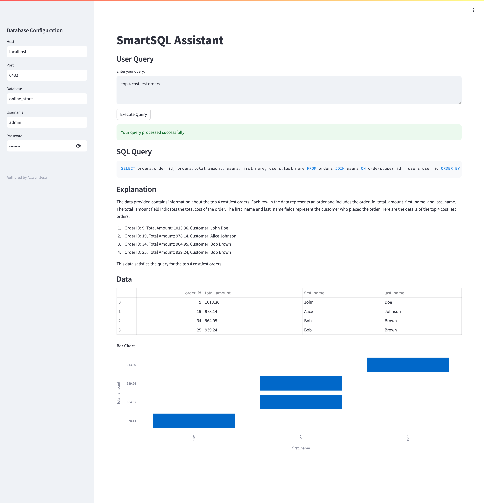
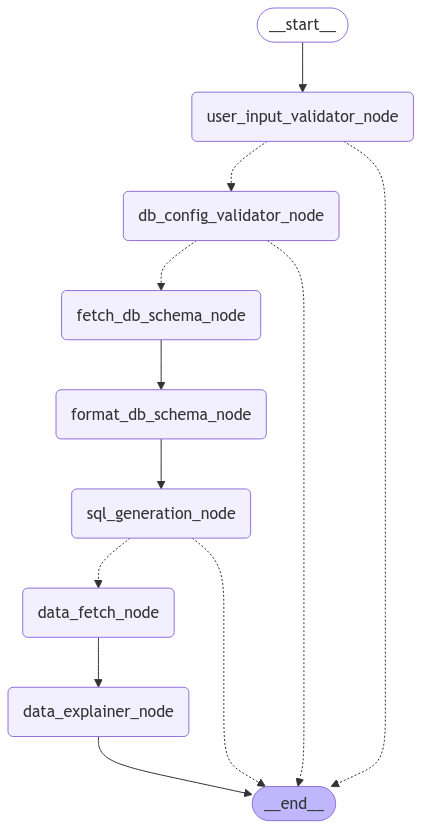

# Text-to-SQL Generator

A beginner-friendly **Text-to-SQL Generator** application that converts natural language queries into SQL statements. The project dynamically fetches database schema information on the fly and explains the data, making it an excellent learning tool for beginners exploring the fundamentals of Text-to-SQL conversion. This app supports only **PostgreSQL** databases

This implementation uses **LangGraph** to process user queries, generate SQL, and explain the output data. Future iterations of this project aim to optimize the code for enhanced performance and scalability.

---

## Screenshot of the application



---

## Features

### 1. Dynamic SQL Generation
- Converts natural language queries into structured SQL statements.
- Dynamically fetches database schema information at runtime for real-time query generation.

### 2. Data Retrieval and Explanation
- Fetches and processes data from the database dynamically based on the generated SQL.
- Provides meaningful explanations of the retrieved data to help users understand the results.

### 3. Visualization Support
- Automatically detects whether the query results can be visualized.
- Dynamically generates visualizations (e.g., Bar Charts, Line Charts) for supported queries.

### 4. Beginner-Focused Design
- Simplified project implementation to help beginners understand the basics of Text-to-SQL conversion.
- Provides clear and meaningful error messages for unsupported queries or schema issues.

---

## Workflow



---

## How It Works

1. **User Input**:
   - Users enter a natural language query in the application interface.
   - Example: *"What are the total sales grouped by product categories?"*

2. **Dynamic Schema Fetching**:
   - The application fetches the database schema dynamically during runtime to process the query.

3. **SQL Query Generation**:
   - The application uses **LangGraph** to map user queries to SQL statements based on the fetched schema.

4. **Data Retrieval and Explanation**:
   - Executes the generated SQL to retrieve relevant data.
   - Provides a detailed explanation of the results to enhance user understanding.

5. **Visualization**:
   - If applicable, visualizes the results using dynamic charts (e.g., Bar Chart, Line Chart).

6. **Error Reporting**:
   - Errors related to schema mismatches, unsupported queries, or missing information are flagged with meaningful messages.

---

## Limitations

- **Dynamic Schema Fetching**:
  - Fetching the schema on the fly is not ideal for production. In future iterations, schemas will be pre-processed and stored for efficient retrieval.

- **Optimization Scope**:
  - The current code focuses on simplicity and learning. Future versions will optimize for performance, scalability, and advanced features.

---

## Setup and Installation

1. Clone the repository:
   ```bash
   git clone git@github.com:AllwynJesu/langgraph-text-2-sql.git
   cd langgraph-text-2-sql
   ```

2. Install the required dependencies using Poetry:
   ```bash
   poetry install
   ```

3. Install the required dependencies using Poetry:
   ```bash
   poetry run streamlit run app.py
   
4. Access the application in your browser at http://localhost:8501

## License

This project is licensed under the MIT License.

### Author

Developed by Allwyn Jesu.

This project demonstrates the fundamentals of Text-to-SQL conversion using LangGraph. Future iterations will focus on optimizing the code for better performance, handle multi-user requests, memory and incorporating advanced features.

